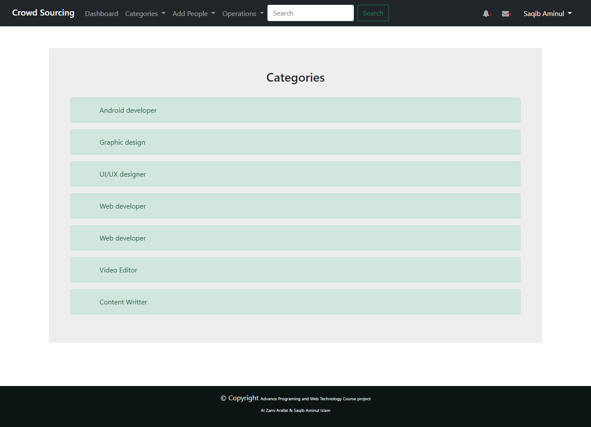

# Simple Freelancing website in Laravel

## What requirements were fulfilled -> 

- Middleware
- Report generation (PDF)
- Third party library (packagist - guzzleHttp request)
- Server side validation (All forms)
- DB migration (MySql)
- System Merged
- Microservice
- Use of Ajax
- Use of JSON
- API Integration

### A short description:

A simple freelancing website which was created by **Aminul Islam Saqib** and **Al Zami Arafat** as a Team.
Database MySQL is used and for frontend bootstrap and some row css code used.

Three types of user: 1. Admin    2. Seller   3. Buyer

Common Features for all user:
1.	All Users can Log-in / logout
2.	All users can see the work post in their timeline
3.	All Users can be able to setting their profile
4.	Can reset password
5.	Profile show
6.	Can profile picture upload
7.	There will be a Home page logged-in or logged-out everybody will be able to see

Admin Role:
1.	Can delete buyer/seller profile for any violence.
2.	Can check buyer/seller profile to validate (accept secrete settings).
3.	Can send message buyer/seller.
4.	Can Create Services categories.
5.	Can delete Seller content (irrelevant job post).
6.	Can post guide which will appear to seller’s home page/timeline.
7.	Can write articles to blog (related to guideline).
8.	Can edit own profile.
9.	Can register another admin
10.	Can change password.
11.	Can edit terms and services.
12.	Can check Sellers log in/out history.
13.	Admin will be able to see buyers/sellers + admins total lists
14.	Can block Seller/buyer account for any disobey the rules.
15.	Users can’t register as admin
16.	Admin can read notifications

Buyer Role:
1.	Can registration as buyer.
2.	View Profile
3.	Edit/Update Profile
4.	Can search the seller by category 
5.	Can see the history which work done 
6.	Can delete the own history
7.	Can download which posts publish 
8.	Can publish post to hire seller.
9.	Can edit post.
10.	Can change the status of posts
11.	Can delete post.
12.	Can change password.
13.	Can contact Seller
14.	Can request seller for works
15.	Can review Seller.
16.	Can see Sellers profile.
17.	Able to transfer money to sellers account.
18.	Can contact to Admin.

Seller Role:
1.	Can registration as seller.
2.	Can publish request to work.
3.	Can edit profile.
4.	Can delete account.
5.	Can check log-in history.
6.	Can delivery the work.
7.	Can edit published requested post.
8.	Can chat with buyer.
9.	Can withdraw/ transfer money.
10.	Can see other Sellers profile.
11.	Can Change password.
12.	Can delete published work requested post.
13.	Can maintain active status (available or not to work).
14.	Can make work deadline.
15.	Can read the blog.

The Buyer part has been done by Al Zami Arafat and the `Admin` part done by `Aminul Islam Saqib`

**Snapshots of the project**

Login with Validation of at least 6 digits password

The new one can also do  registration as Buyer or Seller **But Not as Admin**
There are some validation with **Email must be valid**, **password should be matched With Retype Password**, **Contact should be at least 11 character in the context of Bangladesh**, **If someone try to regiter as Admin it will show a warning message**

The Admin Dashboard

Admin's Own Profile page where a download button which will generate a pdf file of personal profile information.

Admin Profile Edit page where admin can upload profile picture and edit the personal information

Admin Can add new Category from Categories > Add category

Admin Can see Categories from Categories > See Categories

Admin Can see Admin Lists, Buyer Lists, Sellers List
Admin Also Can search the users where **live search implemented by Ajax**.

Admin Lists

Buyers List

Sellers List

Password reset with validation

Buyer Profile view which Admin can see and admin can delete or message or can see buyers activity history

The buyer history page which admin can see

Only admin can register another admin 

An admin can see another admins profile and his/her activity history by clicking the activity button

As I used `Microservice` system with **NodeJs** server, If the NodeJs server dosen't run then this error will be shown which was handled by `try-catch` handler.

If the NodeJS server run's the admin will be able to see another admins activity

